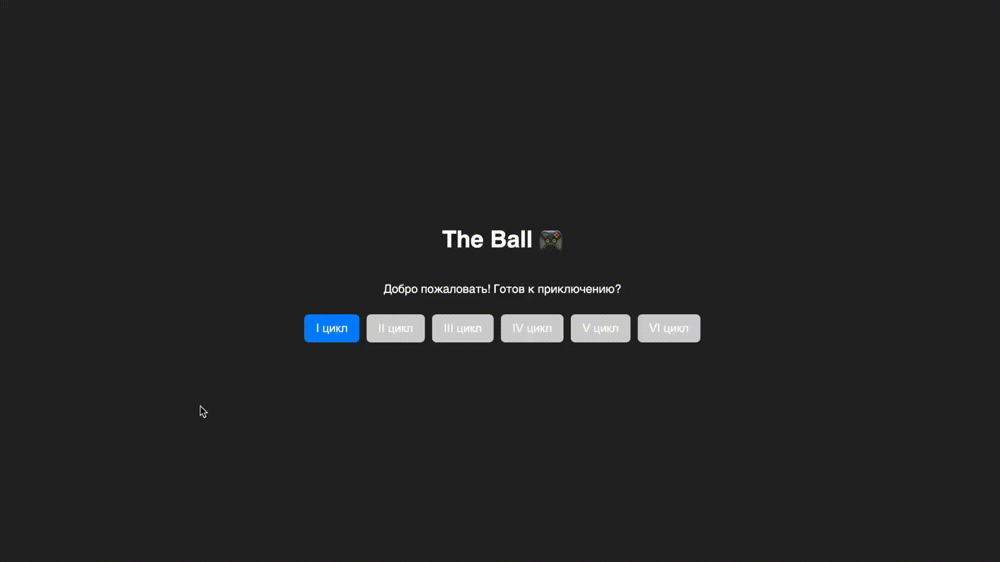
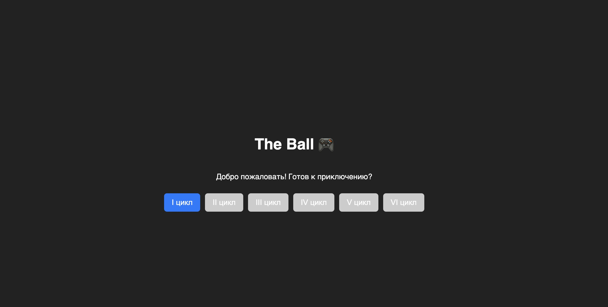
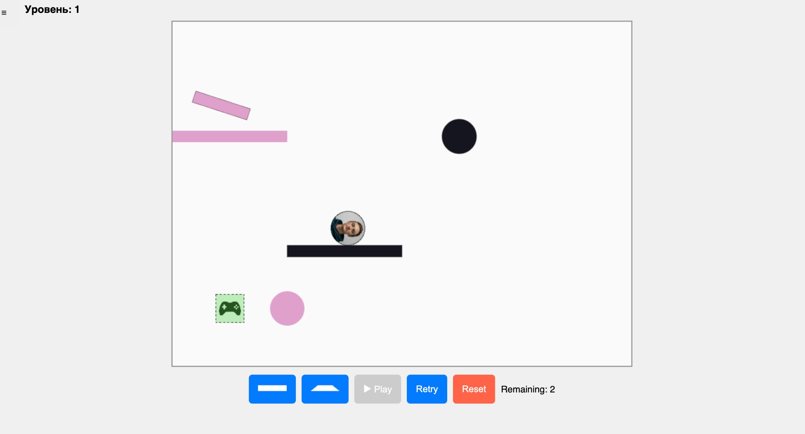

# SummerSchool2025_testTask



# Геймплей

- ЛКМ - поставить/удалить объект;
- ПКМ - вращать объект;




Объекты на поле:

- Розовые - размещенные игроком и которые игрок может двигать;
- Черные - размещенные на уровне и которые игрок не может двигать.

## Установка и запуск

Перейти в корень проекта и выполнить команду:

```shell
npm run start
```

после этого запустится веб-сервер по адресу http://localhost:8080/

Демо доступно по ссылке: https://theball.aoai.ru/

## Библиотеки

Matter.js - physics engine

## Используемые технологии

- localStorage - для сохранения прогресса между сессиями браузера;

## Классы

- ball.ts - объект шарика, его создание и свойства;

- engine.ts - отвечает за игровой движок: создание мира, привязку к игровому полю, рендер;

- index.ts - стартовый связующий скрипт;

- levels.ts - список объектов, описывающих параметры уровня: начальная позиция шарика, начальные объекты, местоложение зоны победы;

- loader.ts - обработка уровней: загрузка, разблокировка, сохранение прогресса;

- placeables.ts - набор возможных к размещению объектов.

- placement.ts - отвечает за обработку взаимодействия с объектами в игре. Обрабатывает предпросмотр размещаемого объекта, поворот, размещение и перемещение объектов,

## Разработка

- Как добавить уровень?\
  В классе levels.ts добавить ещё один объект в массив, указав:

  - ballPosition - местоположение мяча
  - obstacles - размеры и положение зафиксированных объектов
  - movable - размеры и положение передвигаемых объектов
  - goalArea - размеры и местоположение победной зоны

## Что улучшить

- Как-то отдельно хранить состояние уровня: с объектами, рендером, состоянием мяча.

- Вынести UI в отдельный класс.

- Отрефакторить классы, разграничить ответственность. Пока что не совсем понял, как правильно распределить функции между index, loader, и placement, например. В идеале, index ничего не должен знать об игре?

- Хранение уровней вынести в текстовый файл JSON. Добавить режим редактирования уровней, в котором можно создавать и изменять уровни и сохранять их в формате JSON.

- Добавить конфигурационный JSON файл с параметрами игры: основные цвета; время простоя мяча, приводящее к поражению; физические параметры мяча; размеры поля.

- Адаптировать для экрана смартфона.
